  

<h2 align="center">📊 What I work with</h2>

  

  

<h2 align="center">🛠 Technologies</h2>

  

<h2 align="center">📂 Projects</h2>

  
  
  

<h2 align="center">👤 About me</h2>

Hi! I'm **Nikita**, a product analyst with 3+ years in fintech and streaming. I built product analytics from scratch at a cross-border transfers neobank (fiat + USDT, KYC, payouts to 10+ countries) and cover the full cycle: **data → insight → experiment → rollout**.

**Highlights**
- Designed and ran an A/B test of the KYC flow (MDE, sample size, guardrail metric, z-test): KYC pass rate grew from **34% to 51%**, rolled out to 100% of users
- Built a 7-step funnel from lead to retention, found the two biggest drop-offs and turned them into 8 growth hypotheses prioritized by ICE
- Designed a tracking map and shipped **88 events** via GTM to PostHog and GA4: product data went from 2–3 day manual exports to real time
- Built Airflow ETL pipelines from Postgres to ClickHouse, removing **8 hours/week** of manual Excel work
- Created 10 dashboards in PostHog and Metabase that became the single source of truth for weekly team syncs
- Built a unit economics model for transfers across 10+ corridors that drove pricing and country prioritization
- Ran 12 in-depth user interviews: 10+ backlog items, 3 shipped
